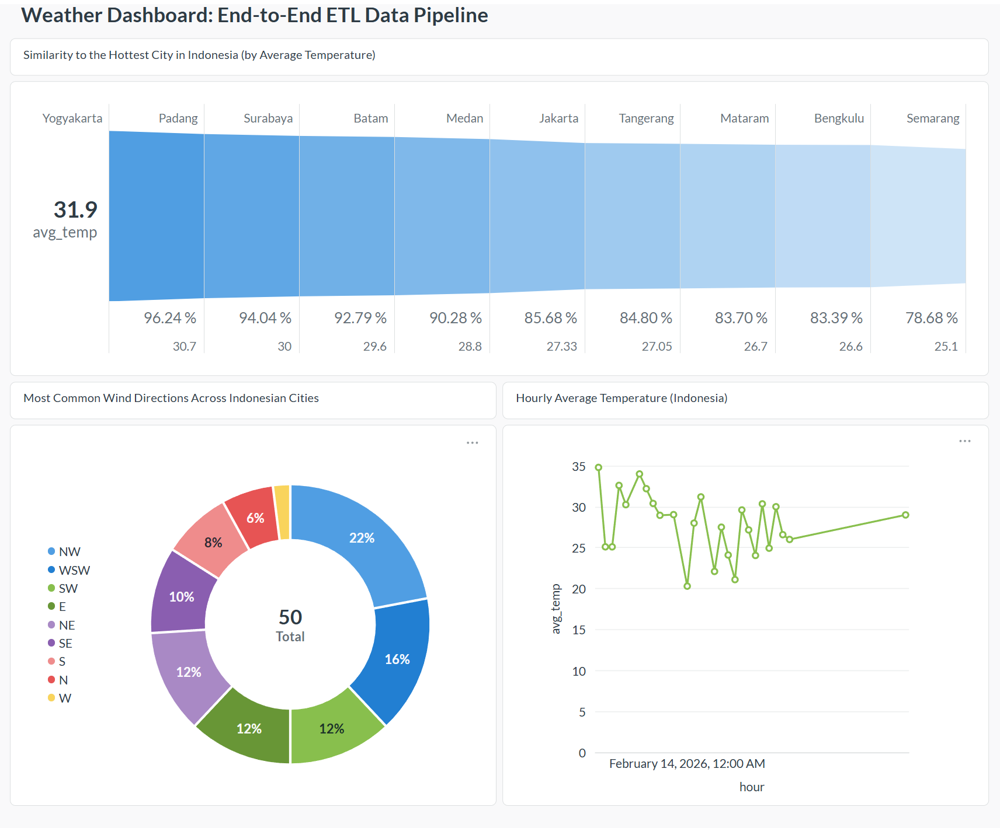

# Weather Dashboard: End-to-End ETL Data Pipeline

An end-to-end local data pipeline that ingests weather data from the **Weatherstack API** every **10 minutes**, orchestrated by **Apache Airflow**, stored in **Postgres (Docker)**, and visualized in **Metabase**.

---

------------------------------------------------------------
What This Project Does
------------------------------------------------------------
1) Extract: Pulls current weather data from Weatherstack (API).
2) Orchestrate: Airflow runs an ETL DAG on a schedule (*/10 * * * *).
3) Load: Inserts records into Postgres.
4) Retention: Keeps only the last 2 days of data (auto-cleanup).
5) Visualize: Metabase connects to Postgres to build dashboards.

------------------------------------------------------------
Tech Stack
------------------------------------------------------------
- Apache Airflow
- Docker / Docker Compose
- PostgreSQL (Docker container)
- Metabase (Docker container)
- Python libraries: requests, psycopg2-binary

------------------------------------------------------------
Project Structure (example)
------------------------------------------------------------
.
├─ dags/
│  └─ weatherstack_to_postgres.py
├─ docker-compose.yml
├─ .env.example
├─ README.md
└─ dashboard.png

IMPORTANT: .env and .env.airflow are NOT committed for security reasons.

------------------------------------------------------------
Quick Start (Docker: Postgres + Metabase)
------------------------------------------------------------
1) Start containers:
   docker compose up -d

2) Services:
   - Postgres host port: 5433 (host) -> 5432 (container)
   - Metabase URL: http://localhost:3000

3) Metabase first-time setup:
   Open http://localhost:3000
   Create admin user
   Add a PostgreSQL database with:
   - Host: postgres
   - Port: 5432
   - Database: weatherdb
   - Username: weather
   - Password: weather
   - SSL: Off

------------------------------------------------------------
Airflow Setup (Local / WSL)
------------------------------------------------------------
1) Activate Python venv and set Airflow home:
   source .venv/bin/activate
   export AIRFLOW_HOME="$PWD/airflow_home"

2) Create .env.airflow (DO NOT COMMIT)
   Example contents:

   WEATHERSTACK_API_KEY=PUT_YOUR_KEY_HERE
   WEATHERSTACK_QUERY=Jakarta
   WEATHERSTACK_UNITS=m

   PG_HOST=localhost
   PG_PORT=5433
   PG_DATABASE=weatherdb
   PG_USER=weather
   PG_PASSWORD=weather

3) Load env variables:
   set -a
   source .env.airflow
   set +a

4) Copy DAG to Airflow dags folder:
   mkdir -p "$AIRFLOW_HOME/dags"
   cp -v dags/*.py "$AIRFLOW_HOME/dags/"

5) Start Airflow (simple mode):
   airflow standalone

   Airflow UI: http://localhost:8080

6) Enable and trigger DAG:
   airflow dags unpause weatherstack_to_postgres
   airflow dags trigger weatherstack_to_postgres

------------------------------------------------------------
Verify Data in Postgres
------------------------------------------------------------
1) Open psql inside the container:
   docker exec -it weather_pg psql -U weather -d weatherdb

2) Run query:
   SELECT id, location_name, temperature_c, humidity, fetched_at
   FROM weather_current
   ORDER BY fetched_at DESC
   LIMIT 10;

------------------------------------------------------------
Stop / Resume
------------------------------------------------------------
Stop containers:
- docker compose stop

Start containers again:
- docker compose start

Remove containers (keeps data unless you add -v):
- docker compose down

WARNING: Do not use "docker compose down -v" unless you want to delete database volumes.

------------------------------------------------------------
Security Notes
------------------------------------------------------------
- Never commit .env or .env.airflow
- Use .env.example as a template only
- Rotate your Weatherstack API key if it is ever exposed

------------------------------------------------------------
How to Push README.md to GitHub (update repo)
------------------------------------------------------------
1) Go to repo folder:
   cd "/mnt/c/Data Engineer/Weather/chatgpt"

2) Check changes:
   git status

3) Add README:
   git add README.md

4) Commit:
   git commit -m "Update README"

5) Push:
   git push origin main

If your branch is master instead of main:
   git push origin master

Check your branch:
   git branch